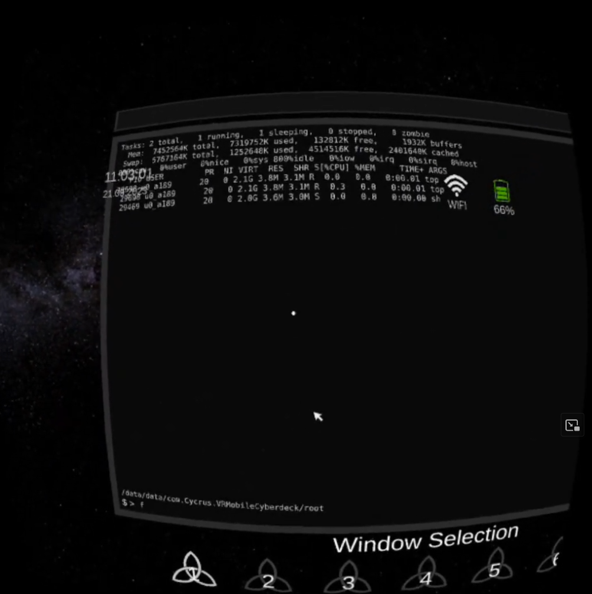

# Android_Utility_Plugin
A plugin for various utilities useful for Android Unity development. It was developed for a custom Unity VR workspace app for Android 13. A number of functionalities have been implemented which are more or less maturely developed. The main feature is the custom terminal emulator function, which offers functionalities to make it possible to implement a working terminal emulator in Unity Android. However, the feature set can only include the most basic functions, since Android does not allow the execution of custom ELF executables by an app.

# Functions
- Terminal
- Audio control
- Battery getter
- Bluetooth control
- Brightness control
- Date time getter
- Flashlight control
- Keyboard getter
- Mouse capture
- Network control (only getter functional due to Android security measures)
- Custom keyboard input getter

# Terminal Emulator
The terminal emulator is written to support functions such as command history, home directory, path, and certain ANSI formatting symbols. It can spawn processes either from the shell in the background, or separated on a designated process stack. It automatically routes the standard input and output of each process to the bottom process, which is the bash shell.

It might seem strangely written at times, especially regarding how input and output are handled. However, those methods were needed to make as many terminal functions available in Unity as possible.

Click on the image below to see a demo video of the terminal emulator.

